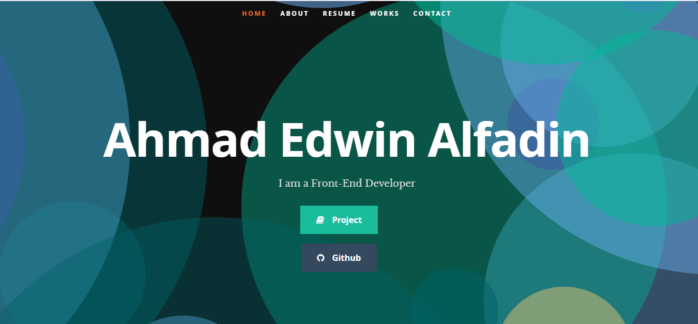
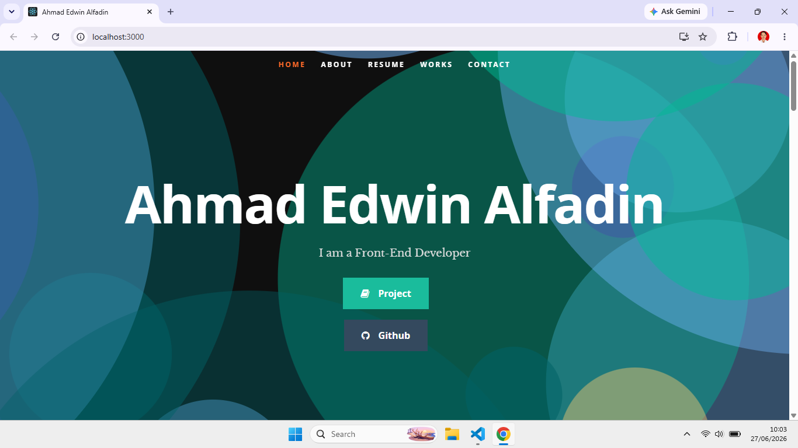

# 🌐 My Portfolio

Live Demo https://edwinalfadin.github.io/My-Portfolio/

Website portfolio pribadi yang dibuat menggunakan *React.js* untuk menampilkan profil, keahlian, proyek, dan informasi kontak.

## 📸 Preview

---

## ✨ Fitur

- 🏠 Homepage
- 👤 About Me
- 💼 Portfolio Project
- 🛠️ Skills
- 📄 Resume
- 📞 Contact
- 📱 Responsive Design

---

## 🛠️ Teknologi

- React.js
- JavaScript (ES6)
- HTML5
- CSS3

---

## 📁 Struktur Folder

my-portfolio/
│
├── public/
│   ├── css/
│   ├── images/
│   ├── js/
│   ├── resumeData.json
│   └── index.html
│
├── src/
│   ├── Components/
│   ├── App.js
│   ├── App.css
│   ├── index.js
│   └── index.css
│
├── package.json
└── README.md

---

## 🚀 Cara Menjalankan

Clone repository

bash
git clone https://github.com/EdwinAlfadin/My-Portfolio/my-portfolio.git

Masuk ke folder

bash
cd my-portfolio

Install dependency

bash
npm install

Jalankan project

bash
npm start

Buka browser

http://localhost:3000

---

## 📷 Screenshot

---

## 👨‍💻 Author

*Ahmad Edwin Alfadin*

- Front End Developer
- GitHub: https://github.com/EdwinAlfadin
- LinkedIn: https://linkedin.com/in/ahmad-edwin-alfadin-alfa

---

## ⭐ Jika project ini bermanfaat

Berikan ⭐ pada repository ini.
